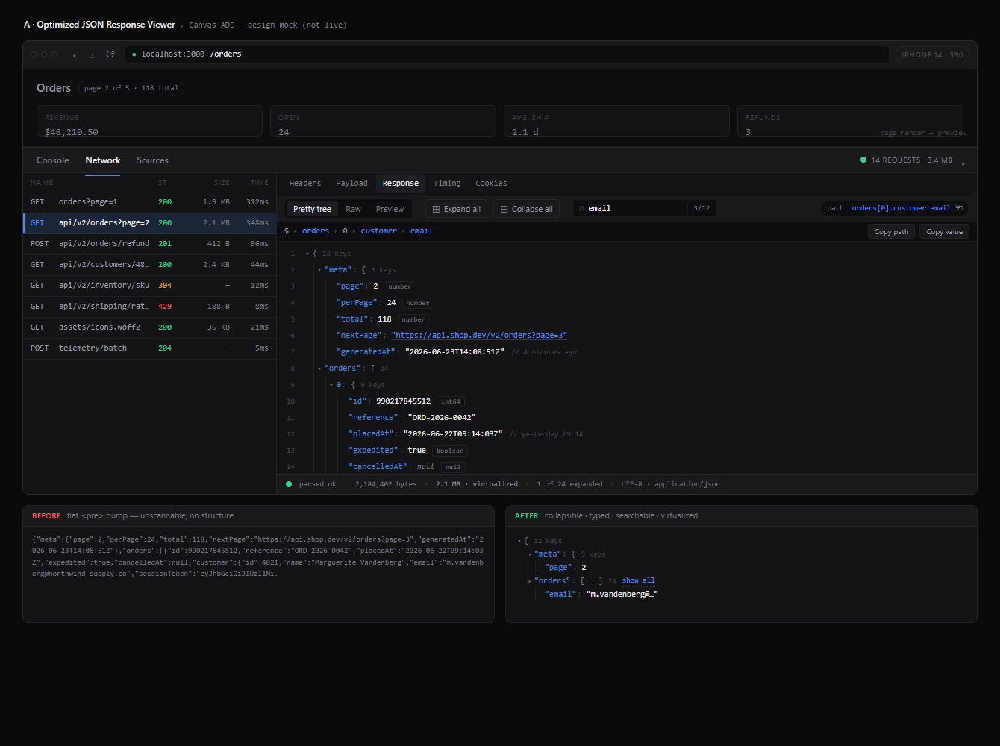
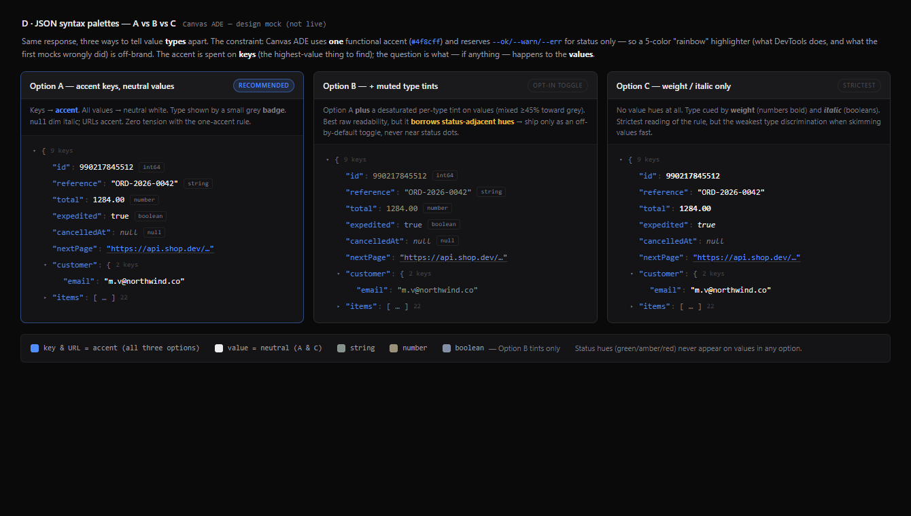
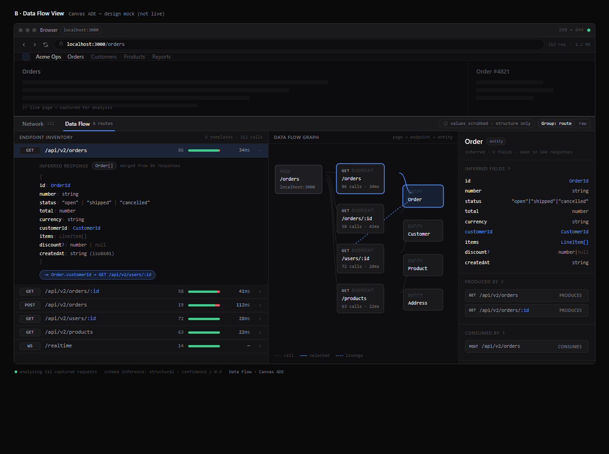
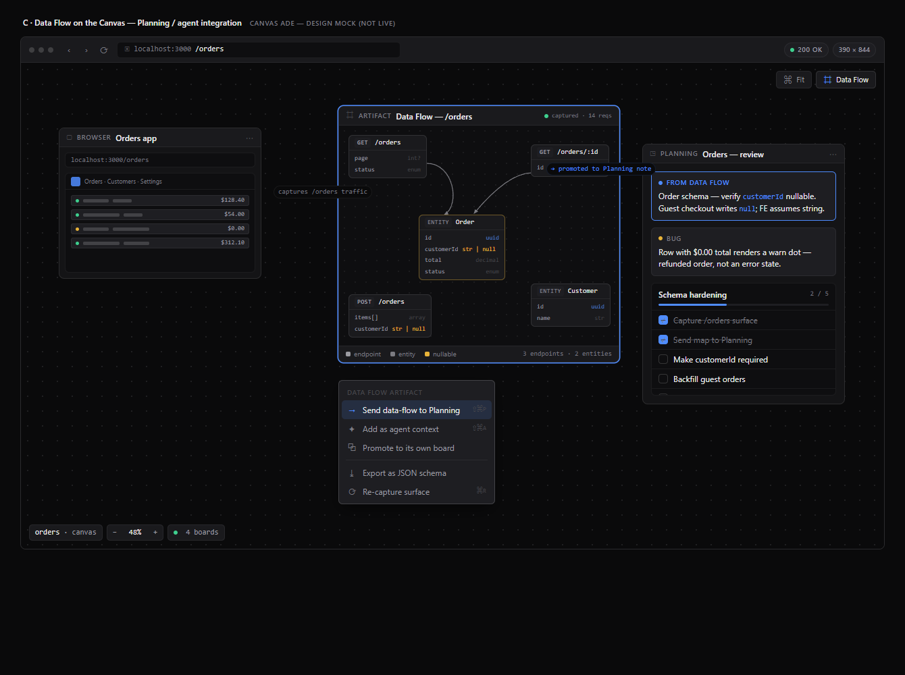

# JSON responses & full data-flow visualization — Browser board

**Date:** 2026-06-23  · **Branch:** `feat/json-dataflow-viz` (off `origin/main` @ `a1f33a7c`)
**Status:** Design proposal — **awaiting sign-off** (no implementation code yet)
**Scope:** the per-Browser-board DevTools **Network inspector** (OSR) — `osrNetFormat.ts`, `OsrNetworkDetail.tsx`, `OsrNetworkPanel.tsx`, `previewOsrNetwork.ts`, `osrNetworkStore.ts`, `browser-devtools.css`.

---

## TL;DR

Today every JSON response is rendered by one expression — `JSON.stringify(JSON.parse(body), null, 2)`
(`prettyBody`, `osrNetFormat.ts:577`) — dumped into a single flat, monochrome
`<pre class="bb-net-bodytext">` with `word-break: break-all`. No syntax differentiation, no folding,
no virtualization, no search, and it re-parses on every render. For any non-trivial payload it is an
**eyesore**, and the inspector only ever shows **one body at a time** — it never aggregates the API
surface the developer is actually building.

This report proposes two things:

- **Part A — "the fix":** replace the `<pre>` with a small, **vendored** (no heavy deps) React JSON
  **tree viewer** — collapsible, syntax-aware (**Option A: accent-on-keys, neutral values** — the only
  scheme that respects the one-accent rule), with in-body search, copy-path, big-integer/duplicate-key
  fidelity, and virtualization — built on a **lenient, source-string-driven tokenizer** (not
  `JSON.parse`), tokenize-to-React-elements (never `dangerouslySetInnerHTML`).
- **Part B — "the vision":** a **Data Flow** view that aggregates the captured traffic (already in the
  store) into a navigable map — an endpoint inventory with inferred response schemas, entities, and
  id-lineage — surfaced first as a panel tab, then as a dedicated **React Flow** board that can be
  promoted onto the canvas and handed to a Terminal-board agent as context.

**Three things need your sign-off** (see §7 + §9): the **syntax palette** (recommend Option A as
default), the **Data Flow surface** (recommend panel-tab → RF board), and the **scope of P0** (recommend
tree + folding + Option-A + Raw toggle + truncation-tolerance, **no** virtualization/search until P1).

> **How this was produced.** A 14-agent dynamic workflow (6 grounded investigators → synthesis → 3
> token-faithful mocks → 3 independent reviewers [feasibility · token-fidelity · completeness] →
> reconcile), run against the clean `origin/main` worktree. Raw agent outputs are in
> [`_research/`](./_research/). The mocks below already incorporate the fidelity corrections the review
> caught (the mocks were originally **rainbow-colored** — the very anti-pattern in question — and were
> rewritten to Option A before screenshotting).

---

## 1. Executive summary

Canvas ADE's Browser-board Network inspector captures rich per-request traffic but renders every JSON response through a single expression — `JSON.stringify(JSON.parse(body), null, 2)` (`prettyBody`, `osrNetFormat.ts:577`) — dropped verbatim into one flat, monochrome `<pre className="bb-net-bodytext">` with `word-break: break-all`, no syntax color, no folding, no virtualization, and no search; it re-parses on every render and is viewed through a 40%/120px-min slit. The result is unreadable for any non-trivial payload and, worse, the inspector is *per-body-in-isolation* — it never aggregates the API surface a developer is actually exercising. This report proposes a two-part answer: **(A) "the fix"** — replace the `<pre>` with a small, vendored, in-repo React tree viewer (flat-row model + custom virtualizer + accent-on-keys coloring + in-body search/path-copy) that honors every security invariant; and **(B) "the vision"** — a **Data Flow** view that aggregates the traffic already in the store into a navigable map of the app's endpoints, inferred schemas, and id-lineage, rendered on the existing React Flow canvas.

## 2. Current state — the capture→render pipeline

The inspector is a single linear pipeline, all of it grounded in existing files:

**Capture (MAIN-only, CDP).** `src/main/previewOsrNetwork.ts` attaches one `wc.debugger.on('message')` listener to the already-attached per-board debugger and arms `Network.enable` + flat `Target.setAutoAttach`. `handleNetMessage` switches on CDP method (`requestWillBeSent`, `responseReceived`, `dataReceived`, `loadingFinished/Failed`, the `webSocket*` family, `Target.attached/detached`) and mutates a bounded ring buffer (`MAX_RECORDS=1000`/board, `MAX_WS_FRAMES=500`/socket, `MAX_SOCKETS=32`). Every page-controlled string is capped *before* it enters the ring (`URL_CAP=2048`, `HEADER_VALUE_CAP=4096`, `WS_PAYLOAD_CAP=16KB`, …). Mutations coalesce through a `FLUSH_MS=100` timer, **only while subscribed**.

**Bodies are never buffered.** The single body egress is the lazy, user-initiated `preview:osrNetGetBody` IPC → `Network.getResponseBody`/`getRequestPostData` on the record's own `sessionId`, then `capBody` (`BODY_CAP = 5 MB`, sets `truncated:true`). Binary flows through base64 untouched.

**Transport.** Six `isForeignSender`-guarded channels in `registerOsrNetworkIpc`; M→R deltas on `preview:osrNet`. Preload (`src/preload/index.ts`) mirrors the types verbatim and fans out one shared `ipcRenderer.on` by board `id` to per-board handlers. `useOsrNetwork(boardId)` subscribes only while the panel is `open` (replay-then-deltas), unsubscribes + `clearBoard` on close/unmount.

**Store.** `src/renderer/src/store/osrNetworkStore.ts` — Zustand, **ephemeral, never serialized** (no `schemaVersion`, no migration). `byBoard[id]: BoardNet = {records[], ws[], dropped, open, dock, tab, preserve, selected?, size?}`. `apply` handles `replay` (replace), `cleared` (empty), `delta` (upsert-by-`requestId` + tail-cap to mirror MAIN's ring). Note `NetTab` is a deliberate single-member union `'network'` "kept so the store shape + the header tab affordance stay intact" — pre-built scaffolding for a second view.

**Render.** `OsrNetworkPanel.tsx` is a flex *sibling* inside `.bb-stage` (not an overlay) so it clips/rounds/z-orders with the board (the ADR 0002 occlusion fix); two docks (`bottom`/`right`), drag-resizable `[0.15, 0.85]`, with the right dock hiding wide columns as a real responsive state. The request list → details pane dispatches subtabs via `tabsFor(selected)` in `OsrNetworkDetail.tsx`.

**The exact JSON path.** User clicks **Load body** → `loadBody` → `getOsrNetBody` → cached in `bodies` keyed `` `${requestId}:${kind}` ``. The body string hits `prettyBody(body, mime, base64)` (`osrNetFormat.ts:577`): base64 → unchanged; `looksJson = mime.includes('json') || /^\s*[{[]/.test(body)` → `JSON.stringify(JSON.parse(body), null, 2)`, else raw on parse failure. The output is rendered as plain React text inside `<pre className="bb-net-bodytext">` at **two converging call sites**: `BodyBar` (Response + request-payload, `OsrNetworkDetail.tsx:108`), and `PreviewTab`'s non-image branch (`:250`). No highlighting, no tree, no virtualization. *(Corrected from the draft's "three" per the feasibility review — see §8.1/C1.)*

## 3. Why the formatted-`<pre>` is an eyesore

Ranked by impact (full audit IDs preserved for traceability):

**HIGH — the core eyesore:**
- **H1 — Zero syntax differentiation.** Keys, strings, numbers, booleans, `null`, punctuation, brackets all render in `--text-2` at mono 11px. The reader must parse the JSON in their head to tell a key from a value — the single largest legibility loss vs. any real viewer.
- **H2 — No collapse/expand/fold.** A static string; a 400-line response forces a full scroll to skip one nested array. (The Headers tab uses real `<details>` disclosure; the body has none.)
- **H3 — `word-break: break-all` mangles every long token.** It breaks *inside* URLs, JWTs, UUIDs, hashes at arbitrary chars, and re-flowing wrapped values back to the left margin destroys the indent ladder — the *only* structural cue present.
- **H4 — Tiny pane.** `.bb-net-details` is 40% height / min 120px; a multi-KB body is viewed through a ~120–200px keyhole with no maximize/pop-out.
- **H5 — No virtualization.** The whole formatted body (up to 5 MB) is one `<pre>` text node, laid out with the most expensive wrapping mode (`pre-wrap` + `break-all`). A real jank/freeze risk under existing OSR frame pressure.
- **H6 — Re-parse on every render.** `prettyBody` runs `JSON.parse`+`JSON.stringify` *inside render*, uncached, on every tab switch/selection/resize; the body is also held twice (raw + pretty), doubling a 5 MB footprint.
- **H7 — No in-body search.** The powerful row filter never reaches inside a body; finding a field is pure scroll-and-eyeball.

**MEDIUM — absent expected affordances:** M1 no copy-value/copy-path/copy-as; M2 no path breadcrumb; M3 no line numbers/indent guides; M4 no type badges or array/object counts; M5 no nested-JSON-in-string detection; M6 NDJSON/SSE/GraphQL/form/XML all fall back to raw; M7 binary/base64 is a dead-end label; M8 the lossy `/^\s*[{[]/` heuristic gives no pretty⇄raw toggle and no "couldn't format" notice; **M9 — truncated 5 MB bodies fail `JSON.parse` → silently lose ALL formatting** (the bodies that most need structure are guaranteed to lose it).

**LOW — polish:** L1 no URL/timestamp/color affordances; L2 no response diff; L3 no key-filter; L4 no body-level raw/parsed/wrap toggle (Headers has one); L5 body numbers don't use `tabular-nums`.

**The big-picture gap (G1)** frames the whole report: every body is an island. The row table aggregates *metadata* (status/size/timing) but the *payload semantics* — the data the user actually cares about — are never aggregated, compared, or related. That is what Part B targets.

## 4. Design Part A — The JSON viewer ("the fix")

### The component

A new, vendored, dependency-light component `JsonView` lives under `src/renderer/src/canvas/boards/osr/JsonView.tsx`, with all pure logic in `src/renderer/src/lib/osrJson.ts` (unit-tested, no React — the "table-math → lib" doctrine atop `osrNetFormat.ts`). It is a **new file** by necessity: the `max-lines: 700` lint cap leaves no room to bolt a non-trivial tree onto `OsrNetworkDetail.tsx` (423) or `OsrNetworkPanel.tsx` (596).

**The architectural spine — flat-row model (the load-bearing insight from jless / virtual-json-viewer / Firefox):** parse the body once, pre-walk into a single linear array `rows: {id, depth, keyOrIndex, kind, value, parentId, childCount, closeId}[]`. Collapse/expand never deletes rows — it flips an id in a `collapsedSet` and `visibleRows` jumps past a collapsed span via `closeId` (O(1) fold). Everything below hangs off this model; adopt it first. This directly retires H2, H5, H6 (parse once, memoize on `[rows, collapsedSet, arrayWindows]`).

### Feature set — staged

**MUST-HAVE (P0/P1):**
- Flat-row model + memoized `visibleRows`; single-line uniform rows (ellipsize long strings → "show more", never wrap) — this kills H3 and enables the virtualizer.
- **Custom uniform-height virtualizer** (~80 lines vendored; uniform row height makes `react-window` unnecessary): measure container, `start = floor(scrollTop/rowH)`, render `start … start+count+overscan` between top/bottom spacers. Live DOM stays ~10–50 rows regardless of total. Retires H5.
- **Default-collapse by depth** (expand 1–2 levels; auto-collapse containers with `childCount > ~99`) + **size badges** (`{12}` / `[480]`) — retires H4's "huge body in a keyhole" framing and M4.
- **Array windowing** — emit first ~100 children + a synthetic "▸ 49,900 more" row that raises the window in chunks. Caps rows hard.
- **Type coloring** (see palette below) — retires H1.
- **In-body search** + highlight + next/prev (`Ctrl/Cmd+G`), auto-expanding ancestors of a match before scrolling — retires H7.
- **Copy property-path** (`data.users[3].name`) + copy-value + copy-subtree — retires M1.
- **Raw mode** — re-indent from the original source string (not a re-`stringify`, preserving big-number fidelity), with a pretty⇄raw toggle that also resolves M8.
- **Big-number safety** — flag any integer literal with >15–16 significant digits and display the **raw source substring** (`JSON.parse` silently corrupts `>2^53`); never display from a round-tripped Number.
- **Truncation-tolerance (M9 fix)** — the tree builder must tolerate JSON cut mid-token: on parse failure, fall back to the Raw view (preserving today's raw fallback) and render the `…(truncated)` marker, rather than losing all structure.
- **URL values → `shell.openExternal`** (never in-app nav; matches the security contract).
- **ARIA tree** — `role="tree"/"treeitem"`, `aria-level/expanded/setsize/posinset`, the WAI-ARIA arrow-key contract, and `aria-activedescendant` focus (roving tabindex breaks under virtualization when the focused row unmounts).

**NICE-TO-HAVE (P1+):** sticky path breadcrumb; filter-to-matching-keys (prune subtrees with zero matches — the Firefox model, best for a small viewport); nested-JSON-in-string "parse as JSON ⤵" (lazy); timestamp humanization (gated on `*_at`/`ts` key hints); key sorting (non-destructive, in the flatten step); response diff (P3-adjacent); JSONPath-lite query; worker parsing gated on size.

### Syntax-color resolution (pick ONE)

**Ship Option A — monochrome + accent-on-keys — as the default.** Of the three candidates the design-system pass weighed:
- **A (accent-on-keys):** keys → `--accent` mono; values (all types) → `--text` bright mono; punctuation `{}[],:` → `--text-3`; null → `--text-3` italic; structural guides (indent rails, carets, line numbers) → `--text-faint`/`--border-subtle`.
- **B (low-chroma derived tints per value type):** best raw readability, but it's the only option that **repurposes status hues** (`--ok`/`--warn`/`--err`) decoratively — risking semantic collision with a real `--ok` status dot or `--warn` paused badge. Rejected as default.
- **C (weight/italic only, no value hues):** strictest, but too-subtle type discrimination for a data-flow viewer whose whole point is reading values fast.

**Justification:** A is the only option with **zero tension** against the locked one-accent rule — it spends the single accent on *structure* (keys, the highest-value JSON discriminator) and leaves all status semantics untouched. It mirrors the closest in-app precedent: `.bb-net-kv` already marks the "name" with accent and keeps a dim-key/bright-value hierarchy. If user testing shows the monochrome tree is hard to scan, expose **B as an opt-in "syntax tint" toggle only**, with mixes pulled ≥45% toward `--text-2` and tinted values kept out of any region that also shows status dots/badges. Full-saturation `--ok/--warn/--err` is never used for value types.

### Large-payload / perf strategy

- **Thresholds:** <~1,000 visible rows → naive render is fine; ~1,000–5,000 → jank without windowing; ≥10,000 → mandatory. The general figure: 100k naive DOM nodes ≈ 3–8s to mount; virtual-json-viewer measured 100MB/~10k objects ≈ 4s *un*-virtualized. The rule: >100 items = virtualization candidate, >1,000 = mandatory.
- **Plan:** virtualize from the start (uniform single-line rows make it cheap); lazy-flatten collapsed subtrees on first expand; hard-cap total materialized rows (~200k) with a "result truncated" banner; `React.memo` each `Row` by `id`; keep `collapsedSet` in a ref so toggling one node doesn't re-render all.
- **Never auto-pretty-print an unbounded body** — this is the #1 correctness rule from the competitive teardown (Postman's synchronous formatter freezes for ~25s on 15MB and white-screens above ~50–100MB; the official "workaround" is *switch to Raw*). Our body arrives only on an explicit **Load body** click and is already 5 MB-capped, so the gate exists — but the viewer must still default the *tree build* behind that click and stay virtualized.

### Search / path-copy / modes UX

Reuse the existing panel vocabulary verbatim: **Raw / Tree** as `.bb-net-subtab` peers (active = `--text` + `border-bottom-color: var(--accent)`); the per-section `.bb-net-srctoggle` accent-text-button idiom for "expand all / raw"; the search box styled like the existing filter `<input>` in `--inset`; selection/match highlight via `--accent-wash` + the `.bb-net-sel` `box-shadow: inset 2px 0 0 var(--accent)` rail. The scroll body inherits `.bb-net-dbody` (`padding:10px 13px`, thin scrollbar `--border-strong`). Add a **maximize / full-view** affordance for H4 (the panel already has a full-view control). Offer **both** copy modes (DevTools "copy property path" + per-node copy-value/subtree), since the property-path is the highest-leverage affordance for an *AI* canvas — paste `data.items[3].id` straight into a Terminal-board agent prompt.

### How it preserves every security invariant

1. **Tokenize-to-React-elements, never `dangerouslySetInnerHTML`.** The flat-row model builds DOM as React elements; each token (key/string/number/punctuation) is a `<span className=…>` with the value passed as a **child text node** (React-escaped), never as `innerHTML`. Syntax color is class-based CSS, not injected markup. This is the single hardest rule and the flat-row model satisfies it natively (no HTML string ever constructed).
2. **5 MB cap honored + truncation-tolerant.** The viewer consumes the already-capped `BodyState{body, base64, truncated}` and renders `…(truncated)`; the tree builder tolerates a JSON string cut mid-token (parse-fail → Raw fallback, per M9).
3. **Lazy / user-initiated.** No new IPC, no new capture — the viewer renders the existing `bodies` cache populated only on the user's **Load body** click. Renderer never touches Node/native; data still arrives over the `isForeignSender`-guarded `getOsrNetBody`.
4. **Ephemeral.** No store schema change; view state (collapsedSet, search, mode) lives in React component state, dropped on the records→empty transition like the body cache today.
5. **No heavy deps.** Vendored ~80-line virtualizer + hand-rolled flat-row walker + (optional) JSONPath-lite — consistent with vendored perfect-freehand / Mermaid. Avoid `react-json-view` (unmaintained, recursive-render, no big-number safety) and `jq-wasm` (CSP friction). Read `react18-json-view` for its prop model only.

### Files to add / change

- **Add:** `src/renderer/src/canvas/boards/osr/JsonView.tsx` (presentational tree + virtualizer); `src/renderer/src/lib/osrJson.ts` (flat-row walk, path build, big-number flag, source re-indent — unit-tested); `src/renderer/src/lib/osrJson.test.ts`.
- **Change:** `OsrNetworkDetail.tsx` — replace the `prettyBody(...)` content in `BodyBar` (`:106`) and `PreviewTab`'s non-image branch (`:249`) with `<JsonView text mime base64 truncated />`; extract the `looksJson` gate out of `prettyBody` into `osrJson.ts` so both share one detector. `src/renderer/src/styles/boards/browser-devtools.css` — add `.bb-net-json*` classes mirroring `.bb-net-bodytext` (mono 11px, `--text-2` base) + the token color classes.

## 5. Design Part B — The "Data Flow" view ("the vision")

### What it consumes — zero new capture (where possible)

The entire endpoint inventory + call graph is buildable from `osrNetworkStore.byBoard[id].records` (and `.ws`) **with no new CDP plumbing**, because every needed field already rides each `NetRecord` *without a body fetch*: `url`/`method`/`type`/`status`, `initiator` (the triggering request → directed edges), `loaderId`/`frameId`/`navBoundary` (document/page grouping), `startTs`/`endTs`/`timing` (sequence axis), `encodedDataLength`/`decodedLength` (volume), `cacheSource`/`failed` (health), and `WsRecord.frames[]` (sent/recv timeline). The **one** thing that needs bodies is *response-shape* inference (schema/ER/id-lineage) — and that is the privacy-gated tier (below).

### The four inference engines (pure `lib/` modules, the shared substrate)

1. **Endpoint inventory — route-template collapsing.** Group by `method + normalize(pathname)`, collapsing variable segments (numeric→`{id}`, UUID→`{uuid}`, opaque→`{id}`, value-variance→`{param}`), keeping an editable per-template example set. Extend the existing `urlName()` (`osrNetFormat.ts`) to a `routeTemplate()` pure fn. **This is the single most important legibility trick** (Akita's parameter coalescing): without it an observed surface explodes into thousands of per-UUID rows.
2. **Schema inference (monoid merge, JSONoid model).** Fold each JSON sample associatively: type→union (`string|null`), required-iff-present-in-every-sample, arrays→merged `items`, format hints (date-time/uuid/email/uri), capped examples. Result per endpoint = an inferred JSON Schema renderable as a type tree, OpenAPI fragment, or TS interface. **Needs bodies → gated.**
3. **Entity + ER inference.** A repeated object shape with an identity field; PK candidate = `id`/`*Id`/`uuid` short, non-null, high-distinct-ratio; FK = `<entity>Id` whose values overlap another entity's PK (inclusion-dependency test). Output = entities + typed relationships (`User 1—* Order`).
4. **Data-flow / id-lineage (the novel pass).** An id in call A's *response* later appearing in call B's *URL/request* ⇒ directed edge `A ⊳ B` ("A's id drove B"). This is what Postman Flows makes you *wire by hand* — here it's *discovered*. **Needs bodies → gated.**

### Recommended surface (pick + justify)

**Stage the surface to match value/effort — but the recommended flagship surface is a dedicated React Flow board, reached via a panel-tab stepping stone:**

- **First mount = a panel tab** (extend `NetTab` to `'network' | 'dataflow'`, add a `.bb-net-tab` in the header, render `<DataFlowView records ws />` gated on `tab==='dataflow'`). The store comment explicitly notes the one-member union was kept "so the store shape + the header tab affordance stay intact" — the scaffold is pre-built for exactly this. No schema bump (ephemeral store), no new IPC/capture. This ships the **API Inventory** (engine 1, body-free) immediately — "see every endpoint, its statuses, p95, and lazily its shape." It reuses the panel's dock/resize/full-view/clipping for free and respects both docks.
- **Flagship = a dedicated Data-Flow board on React Flow v12** — the canvas-native payoff. Pages/endpoints/entities are RF nodes; calls and id-propagation are edges; auto-laid-out (dagre/elkjs). It sits *on the same infinite canvas as the running Browser board*, so the user can draw their own arrows from a Planning note to an endpoint node and lean on Named Board Groups / grouped-focus for legibility. **Lean into RF** — the engine, custom-node pattern, edges, and pan/zoom already exist; this is the genuine white space no competitor occupies (every tool is either per-request like DevTools or author-it-yourself like Postman Flows). Cost: a new board type = a schema bump per ADR 0007 (register in `boardSchema.ts`/`elementRegistry`) + dagre dep + the body-sampling/privacy path.

**Justification for the order:** the panel tab proves the inference libs on data you already have, body-free, at low effort; the RF board is the high-ceiling flagship but carries the schema bump + body-sampling cost, so it lands last. A **third, cheap surface** — a one-shot **"Sketch the data model" export into a Planning board** (Mermaid `erDiagram` via the existing `makeDiagram`/`materializePlanningOps`, or notes+arrows) — slots between them as the strongest *agent-context* tie-in: the inferred ER becomes durable `.canvas/memory/` the Terminal agent reads. **Critical anti-patterns to obey:** never "draw the whole surface" (GraphQL Voyager / Postman Flows both rot into spaghetti) — default the graph to a **focused subgraph** (focus-on-node + filter); regenerate **idempotently and diff-highlight** changes (Optic) rather than dumping a static map.

### Privacy / scrubbing (design first, not last)

- **Bodies-off by default.** Inventory + call graph need *no* bodies — ship them with zero body access. Schema/ER/lineage gate behind an explicit per-board **"Infer data shapes (reads response bodies)"** opt-in (mirrors the Context subsystem's consent-gated egress + `canvasMemory.setCommitOptIn`).
- **Shape, not values.** Inferred schema stores types/field-names/presence-counts/format-hints — never raw values by default. Example values are a separate deeper opt-in with a PII warning (the JSONoid example-bag is the leak vector). Field *names* (`email`) are kept (schema); values are dropped.
- **Scrub on aggregate/export.** Reuse the Context secret-scrubber on any export; redact `Authorization`/`Cookie`/`Set-Cookie` and any field whose name/format matches a secret/PII pattern.
- **MAIN-side enforcement.** Body sampling/merge happens in MAIN behind the same `isForeignSender` guard as `getOsrNetBody`, capped; the renderer only ever receives merged *schemas*, never raw bodies, unless the user opens one row. Ephemeral by default; export is the consent moment (and inherits `.canvas/` git-ignore-by-default for body-derived data).

### ASCII layout sketch

API Inventory tab (panel surface, body-free, ships first):

```
┌─ Network · Inventory · Data Flow ───────────────────[▤][▥][⤢][x]┐
│ 12 endpoints · 247 calls · 3 with errors        🔒 bodies off ▸ │
├──────────────────────────────────────────────────────────────────┤
│ METHOD  ROUTE TEMPLATE              CALLS  STATUS    p95    SCHEMA │
│ ▾ GET   /api/users/{id}              63    200·404   88ms   {9}   │
│      id        string·uuid   ●required                            │
│      email     string·email  ●required   ⚠ PII  [reveal]         │
│      avatarUrl string|null    optional (41/61)                    │
│      roleId    string·uuid   ●required   →FK Role                │
│ ▸ POST  /api/orders                  9     201·422   120ms  {7}   │
│ ▸ WS    /ws/notifications            1     101      live   ~frames│
├──────────────────────────────────────────────────────────────────┤
│ [Export OpenAPI ▾] [→ Planning board] [→ Agent context]          │
└──────────────────────────────────────────────────────────────────┘
```

Data-Flow board (React Flow flagship), graph layout, focus-defaulted:

```
   ┌──────────────┐   calls   ┌────────────────────┐  returns   ┌──────────┐
   │ PAGE /login  │─────────▶ │ POST /api/session  │──────────▶ │ ◇ Session│
   └──────────────┘           └─────────┬──────────┘            └────┬─────┘
                                token ⊳ (id propagated)              │ FK
                                         ▼                           ▼
   ┌──────────────┐  calls   ┌────────────────┐   returns    ◇ User ──*──◇ Order
   │ PAGE /home   │────────▶ │ GET /api/users │────────────▶          │
   └──────────────┘          └────────────────┘                       └─*─◇ Item
   ── ─── calls   ━━━ returns-entity   ┄┄ id-propagation (lineage)
   [Layout: ⟲ graph | ⇉ sequence | ∿ sankey]   [focus: GET /api/users ▾]
```

## 6. Phased roadmap

### P0 — Viewer fix (smallest shippable `<pre>` replacement)
- **Scope:** flat-row model + memoized `visibleRows` + single-line uniform rows + **Option-A accent-on-keys coloring** + default-collapse-to-depth-2 + size badges + Raw⇄Tree toggle + truncation-tolerant parse-fail fallback (M9). No virtualization yet (correct under the existing 5 MB cap + Load-body gate for typical bodies), no search. Directly retires H1, H2, H3, H4, H6, M4, M8, M9.
- **Files:** add `JsonView.tsx`, `lib/osrJson.ts` (+ test); change `OsrNetworkDetail.tsx` (two call sites), `browser-devtools.css`.
- **Effort:** **M.** **Risk:** Low (no new IPC/capture/schema; isolated swap).
- **Acceptance:** a 200-key nested JSON response renders as a collapsible, accent-keyed tree that folds a large array in one click, with no `dangerouslySetInnerHTML` anywhere in the component (assert via a unit test on the rendered element tree + manual dev check with the PR-stamped title).

### P1 — Viewer enrichments
- **Scope:** custom uniform-height virtualizer + array windowing + hard row cap; in-body search + highlight + next/prev (auto-expand ancestors); copy property-path / value / subtree; big-number raw-source display; URL→`shell.openExternal`; ARIA tree + keymap + `aria-activedescendant`; type affordances. Retires H5, H7, M1, plus a11y.
- **Files:** extend `JsonView.tsx` + `lib/osrJson.ts`; add `lib/virtualizer.ts` (vendored ~80 lines) + test.
- **Effort:** **M–L.** **Risk:** Medium (virtualization + ARIA-under-virtualization focus correctness is the trickiest piece).
- **Acceptance:** a 50k-element array opens instantly with the live DOM holding ≤~50 rows (assert node count via the Playwright `_electron` harness), and `Ctrl/Cmd+G` jumps to a match inside a collapsed subtree after auto-expanding its ancestors.

### P2 — Data Flow inventory + schema
- **Scope:** the four `lib/` inference passes (route-template, monoid schema-merge, entity/PK-FK, prep for lineage); the **API Inventory panel tab** (extend `NetTab`, body-free inventory + lazy per-row schema fill); the **bodies-off-by-default opt-in toggle** + MAIN-side capped sampling behind `isForeignSender`; shape-not-values + scrub.
- **Files:** add `lib/routeTemplate.ts`, `lib/schemaInfer.ts`, `lib/entityInfer.ts` (+ tests), `osr/DataFlowView.tsx`; change `osrNetworkStore.ts` (`NetTab` union), `OsrNetworkPanel.tsx` (tab + gate), `previewOsrNetwork.ts` (opt-in sampling path), `osrNetFormat.ts` (`urlName`→`routeTemplate`).
- **Effort:** **L.** **Risk:** Medium-High (the body-sampling path is the new architecture + the privacy surface; route-template over/under-collapse needs the editable-example escape hatch).
- **Acceptance:** with the opt-in on, repeated calls to `/api/users/{id}` collapse to one inventory row whose expanded schema correctly marks an always-present field `required` and a sometimes-missing field `optional`, with `Authorization`/`Cookie` header values and example values absent from the rendered shape.

### P3 — Data Flow graph + canvas/agent integration
- **Scope:** the id-lineage pass; the **dedicated Data-Flow board** on React Flow (graph layout via dagre, focus-on-node default, sequence layout as a second tab); the **"Sketch the data model" → Planning/Mermaid export**; the **agent-context export into `.canvas/memory/`** with scrub-on-export consent.
- **Files:** add the board-type registration (`boardSchema.ts`/`elementRegistry`, **schema bump per ADR 0007 two-tier**), `osr/DataFlowBoard.tsx`, `lib/lineage.ts`, a Mermaid `erDiagram` serializer; integrate `makeDiagram`/`materializePlanningOps`; add dagre.
- **Effort:** **L.** **Risk:** High (schema bump + new board type + new dep + the lineage pass leans hardest on the privacy work).
- **Acceptance:** clicking through a login→home flow in a Browser board produces a focus-defaulted RF graph where an id returned by `POST /api/session` shows a dashed id-propagation edge to the subsequent request that consumed it, and "→ Planning board" materializes the inferred ER as an editable Mermaid diagram element.

## 7. Open decisions needing user sign-off

1. **Syntax palette (the one-accent tension).** Recommendation: ship **Option A (monochrome + accent-on-keys)** as the default; reserve **Option B (low-chroma derived tints)** as an opt-in toggle only (mixes ≥45% toward `--text-2`, never co-located with status dots), never as default. **Decision needed:** approve A-as-default, and approve/defer B-as-toggle. (Per CLAUDE.md, this UI choice needs a *visible design artifact* — a token-accurate static mock of A vs. B, screenshotted via the Playwright `_electron` harness — before P0 code lands.)
2. **Data-Flow surface.** Recommendation: **panel tab first (P2) → dedicated React Flow board flagship (P3)**, with the Planning/Mermaid export as the agent-context bridge between them. **Decision needed:** confirm the panel-tab-first sequencing and confirm the flagship is a **new board type** (accepting the ADR 0007 schema bump) rather than a permanent panel-only view.
3. **Scope of P0.** Recommendation: P0 ships the tree + folding + accent-keys + Raw toggle + truncation-tolerance **without** virtualization or search (deferred to P1), because the 5 MB cap + explicit Load-body gate make naive render acceptable for typical bodies and this keeps the first PR small and low-risk. **Decision needed:** accept the no-virtualization-in-P0 line, or require virtualization in the first shippable cut (folds P1's hardest item into P0, raising effort to L and risk to Medium).


---

## Design mocks (token-faithful, screenshotted for sign-off)

Per CLAUDE.md *"design artifact before code"*: these are static HTML built from the real
`tokens.css`/`browser-devtools.css` values, rendered + screenshotted. They **already incorporate** the
token-fidelity corrections in §8.4/§8.6 (Option A — accent on keys, neutral values; status hues kept
status-only; methods neutralized; no glow rings; `--connector` not shadowed). Open the `.html` files to
inspect pixels.

### Mock A — Optimized JSON Response Viewer (the P0 fix)
Collapsible, syntax-aware tree with toolbar (Pretty tree / Raw / Preview · Expand/Collapse all ·
in-body search `3/12` · copy-path chip), child-counts, array windowing ("show 22 more"), `int64`
big-number badge, truncated-token "hover to expand", a clickable URL value + humanized timestamps,
a path breadcrumb, and a **before/after** strip contrasting the flat `<pre>` with the structured tree.



→ [`mock-a-json-viewer.html`](./mock-a-json-viewer.html)

### Mock D — JSON syntax palettes (A vs B vs C)
Built to make the §7.1 palette decision judgeable on pixels: the **same** response rendered three ways.
**Option A** (accent keys, neutral values, grey type badges) is recommended; **Option B** adds muted
per-type value tints as an opt-in toggle; **Option C** uses weight/italic only. Status hues
(`--ok/--warn/--err`) never touch values in any option.



→ [`mock-d-syntax-palettes.html`](./mock-d-syntax-palettes.html)

### Mock B — Data Flow view (endpoint inventory · inferred schema · flow graph)
A new **Data Flow** tab: route-template-collapsed endpoint inventory with call counts, status-mix bars
and p50; an expandable **inferred merged schema** (`required`/`optional?`, unions, `id`/foreign-key types
in accent); a calm page→endpoint→entity graph with the selected path + a dashed **id-lineage** edge; a
right-hand entity inspector ("produced by / consumed by"); and a "values scrubbed · structure only"
privacy chip.



→ [`mock-b-data-flow.html`](./mock-b-data-flow.html)

### Mock C — Data Flow on the canvas (Planning / agent integration)
The vision frame: the Data-Flow map promoted out of the panel onto the infinite canvas as a first-class
board, wired by canvas connectors **Browser board → Data Flow board → Planning note**, with a context
menu ("Send data-flow to Planning · Add as agent context · Promote to its own board · Export as JSON
schema"). The captured API surface becomes durable, shareable canvas context.



→ [`mock-c-canvas.html`](./mock-c-canvas.html)

---

## 8. Feasibility, corrections & open risks

This section folds the three independent reviews — **feasibility** (adversarial, code-grounded), **token-fidelity** (mock vs. `DESIGN.md`), and **completeness** (gap audit) — into a single dispositioned ledger. Each point is **ACCEPT** (with the resulting change to the design/roadmap) or **DECLINE** (one-line reason). Where two reviews collide, the contradiction is resolved inline.

### 8.1 Corrections to the audit's factual claims (apply before publishing §2–§4)

| # | Source | Finding | Disposition |
|---|---|---|---|
| C1 | Feasibility #5 | §2 says `prettyBody` has "three converging call sites." It has **two** live sites — `OsrNetworkDetail.tsx:108` and `:250` — plus the definition. | **ACCEPT.** Correct §2 to "two call sites." (Verified: grep shows exactly `:108` and `:250`.) The §4 migration list already said "two," so only §2 changes. |
| C2 | Feasibility #4 | The `max-lines:700` cap uses `skipBlankLines/skipComments`, so the real budgets exceed the raw `wc -l` 423/596 figures. | **ACCEPT (framing only).** Keep `JsonView.tsx` as a new file (a virtualized tree blows any budget), but rewrite the justification from "423/596 leave no room" to "a non-trivial virtualized tree warrants its own file per the one-file-one-purpose rule." |
| C3 | Feasibility #6 | The `NetTab` single-member union is a **vestige** of removed Assets/Downloads tabs ("kept so the store shape + header tab affordance stay intact"), not deliberate scaffolding for Data Flow. | **ACCEPT.** Drop the "pre-built scaffold" spin in §5; state plainly that extending the union is *mechanically* cheap (ephemeral store, no schema bump) — which is the only claim that matters. |

### 8.2 Part A — the JSON viewer ("the fix"): confirmed feasible, with corrections

**Security & invariants — pass, no action.**
- Feasibility #10/#11 and the proposal agree: the flat-row / token-to-`<span>` model satisfies the no-`innerHTML` invariant natively, and the viewer honors the 5 MB cap, lazy/user-initiated body fetch, the `isForeignSender` guard, ephemerality, and the no-heavy-deps doctrine. **All invariant pressure is in Part B, not Part A.** No change.

**Accepted corrections (change the P0 spec):**

| # | Source | Finding | Resulting change |
|---|---|---|---|
| A1 | Feasibility #7 + Completeness #2 | "No virtualization needed under the 5 MB cap" is unsafe as *worded* — a 5 MB body can exceed 100k rows, past the proposal's own "mandatory" line. P0 is defensible **only because default-collapse-to-depth-2 bounds *visible* rows**, not because of the byte cap. | **ACCEPT.** Re-word the P0 rationale: *default-collapse* is what bounds initial DOM. Gate "expand all" / deep expansion behind the **P1 virtualizer** (expanding a 50k array in P0 is the H5 freeze). Add to P0 acceptance: "initial visible-row count is bounded by collapse depth, independent of body size." |
| A2 | Completeness #4 (cross-cutting) + Completeness #1/#2/#5 | The whole design is built on `JSON.parse`/`JSON.stringify` semantics, but a wire-faithful inspector must be **source-string-driven**: `JSON.parse` silently drops **duplicate keys**, loses **key order**, corrupts **big integers**, and can't represent a **truncated** body. These are four gaps with one root cause. | **ACCEPT — highest-leverage change.** Make the **P0 spine a single lenient, source-preserving tokenizer** in `osrJson.ts` (walk the original string, not `JSON.parse` output). This collapses big-number safety (already specced), duplicate-key survival (+ a "duplicate key" badge), key-order fidelity, and truncation-tolerance into **one** architectural decision. Raw mode becomes lossless **by construction**. This supersedes the separate "big-number patch" framing. |
| A3 | Completeness #2 | M9 ("parse-fail → Raw") leaves the >5 MB *valid-prefix* tree unspecified — the largest bodies dump back into the unreadable `<pre>`. | **ACCEPT** (subsumed by A2). The lenient tokenizer builds the flat-row model **up to the truncation point** and emits a terminal `…(truncated at 5 MB)` row. "Tree of a truncated body" becomes a **P0 acceptance criterion**, not a P1 nicety. |
| A4 | Completeness #1/#3/#5 | Non-JSON body kinds (NDJSON, SSE, GraphQL, form/urlencoded, multipart, XML/HTML), error/empty bodies (204/304, 4xx/5xx JSON envelopes, HTML-in-JSON-slot, body-fetch-failed), and request payloads are named (M6) but never designed → re-inflict every H-class eyesore. | **ACCEPT (re-scoped, see sequence).** Add a `detectBodyKind(mime, body)` dispatcher in `osrJson.ts` alongside `looksJson`. **P0:** JSON tree + form/urlencoded → existing `.bb-net-kv` table + the four error/empty states (each labeled, never a blank or unlabeled raw string). **P1:** NDJSON/SSE → per-record sub-trees reusing `JsonView`; GraphQL → tree with `errors[]` surfaced first; multipart request → parts-list (not a base64 dead-end). XML/HTML stay raw but as a **labeled, explicit** decision. |
| A5 | Completeness #12 | BOM (`\uFEFF`) breaks the `/^\s*[{[]/` heuristic; `Content-Encoding: gzip/br` decode behavior and non-UTF-8 charsets are unhandled. | **ACCEPT (small).** Strip BOM before the `looksJson` test in `osrJson.ts`; document the CDP `getResponseBody` decode assumption (it returns decoded text); treat undecodable charsets as the labeled binary dead-end. Fold into P0 (BOM strip) + P1 (charset/encoding notes). |
| A6 | Completeness #6 | WebSocket frame JSON (`WsRecord.frames[]`, 16 KB cap) hits the same raw `<pre>`; the inventory sketch even shows `~frames`. | **ACCEPT → P1.** Route each text frame through `JsonView` in the WS detail subtab — near-free once the viewer exists. |
| A7 | Feasibility #8 + Completeness #11 | The custom virtualizer must re-measure on the panel's continuous drag-resize `[0.15,0.85]` and dock switch, or rows blank mid-drag; and the tree's maximize must not duplicate the panel's full-view control. | **ACCEPT → P1.** Add an explicit "viewer ↔ panel chrome" contract: virtualizer height = observed `.bb-net-dbody` via `ResizeObserver`, re-measured on dock/resize/full-view transitions (debounced to the existing settle); **reuse the panel's full-view** for H4 — do not add a second maximize. |
| A8 | Completeness #7/#8 | A11y is specced for the tree but not the surface: focus order between row-list ↔ subtabs ↔ search ↔ tree, an SR live region ("loaded N / truncated / N matches"), `Ctrl/Cmd+G` collision check against Browser-board shortcuts, and theming for the **new** affordances (NDJSON/SSE/form/duplicate-key/truncation/PII-reveal chips) within the one-accent rule. | **ACCEPT → P1.** Extend the a11y section to span the panel (not just the tree); verify the search keymap against the Browser board's key handling; extend the Option-A palette spec to **every** new affordance and confirm none reach for `--ok/--warn/--err` decoratively. |
| A9 | Feasibility #9 | "Raw mode re-indents from the original source" is a small tokenizing pretty-printer, not a one-liner — don't under-scope `osrJson.ts`. | **ACCEPT (note).** No plan change — the lenient tokenizer (A2) *is* that pretty-printer; this just confirms `osrJson.ts` is non-trivial and unit-tested, which P0 already budgets. |

### 8.3 Part B — the "Data Flow" view ("the vision"): two genuine holes + scope corrections

| # | Source | Finding | Disposition |
|---|---|---|---|
| B1 | Feasibility #1 (**major**) | Part B claims `initiator` yields "the triggering request → directed edges." **It does not.** `initiator` is typed `string` and `initiatorOf` (`previewOsrNetwork.ts:197`) flattens the CDP object to a **display string** (script URL or a type word, or literal `'Redirect'`) — no `requestId`, so a request cannot be resolved back to its trigger. | **ACCEPT (correctness fix).** Scope the **call edges to coarse page/loader grouping** (computable today — see B2). To get true request→request edges, MAIN must preserve a **structured initiator** (script-url + optional triggering `requestId`) — **new CDP/MAIN capture work**, contradicting "zero new CDP plumbing." Move structured-initiator edges into **P3** as explicit MAIN work; redraw the §5 ASCII sketch so PAGE→endpoint edges (loader-derived) are solid and request→request edges are absent until P3. |
| B2 | Feasibility #2 | Page/document grouping via `loaderId` (`requestId===loaderId ⇒ main doc`), `frameId`, `navBoundary` **is** computable. | **ACCEPT (keep claim).** This is the body-free backbone of the P2 inventory/graph. No fix beyond not overstating finer edges (B1). |
| B3 | Feasibility #3 (**major**) + #12 | The id-lineage pass (engine 4) and schema inference need bodies for **many** requests, not one — contradicting the lazy/single-body Load-body model the proposal's own perf section forbids auto-fetching. And "required-iff-present-in-every-sample" is **unsound on truncated samples** (cut trailing fields mis-inferred as optional). | **ACCEPT (re-architect the tier).** Engines 2/3/4 are **not** pure `lib/` passes — they require a **MAIN-side bounded body-sampling subsystem** (cap N bodies, cap bytes each, behind the opt-in + `isForeignSender`). Only **URL-side id-matching** (ids in URLs/query — body-free) ships without it. Add to engine 2's contract: **truncated samples are shape-only** (types yes; required/presence **no**). Full body-based lineage moves firmly to **P3** with the sampling subsystem as a named dependency. |
| B4 | Completeness #9 | Route-template collapsing has an editable escape hatch but no specified behavior for the **dangerous** directions: under-collapse hazards (`/api/v1` vs `/api/v2` wrongly merged) and over-collapse (single-endpoint GraphQL `POST /graphql` carrying 50 ops → one mega-node). | **ACCEPT → P2.** Use **GraphQL operation-name** as the grouping key for single-endpoint APIs; add guardrail acceptance tests for both under-collapse (v1/v2 stay distinct) and over-collapse (1000 ids → one template, with the editable example set). |
| B5 | Completeness #10 | "Thousands of captured requests" (G1) collides with the `MAX_RECORDS=1000`/board ring; the **row table** and the **graph** are never themselves virtualized/budgeted. | **ACCEPT.** Reconcile the framing: "thousands" = across boards/over time, capped at 1000/board live. State the **row-list virtualization status** (reuse the P1 viewer virtualizer) and a **graph node-count budget** with the **focus-subgraph default** as the mitigation (already the anti-spaghetti rule). |
| B6 | Completeness #9 (privacy) | Scrubbing is well-designed (no change), but high-cardinality-route failure is the under-tested risk. | **ACCEPT** (covered by B4). Privacy design stands. |

### 8.4 Token-fidelity (mocks vs. `DESIGN.md`) — the rainbow-syntax violation

The fidelity review found both mocks nail surfaces/borders/text/radii/chrome, with **one systemic violation in both**: off-palette **rainbow JSON/type syntax coloring**, which directly contradicts `DESIGN.md §1.2` ("One accent, used functionally only… Everything else is neutral grey") and `§1.3` (purple is banned).

| # | Finding | Disposition |
|---|---|---|
| F1 | Mock A & B type-code *values* with off-token green/amber/violet/blue (`.v-str/.v-num/.v-bool`, `.t-string/.t-number/.t-bool/.t-id`, matching `.badge.*`). Purple (`.m-ws`, `.t-id`, `.v-bool`) is an outright `§1.3` ban. | **ACCEPT — and this directly validates the §4 design decision.** It confirms **Option A (accent-on-keys, neutral values)** as the only on-contract default; **Option B (low-chroma value tints) is rejected as default** and survives only as a possible opt-in toggle (mixes ≥45% toward `--text-2`, never co-located with status dots). The mocks must be fixed before sign-off (see §8.6). This **resolves the §7 Decision-1 tension in favor of A**. |
| F2 | HTTP-method labels tinted with status/off-token hues (A: `.m.post`→`--ok`; B: `.m-get/.m-post/.m-ws`, `.role.*`). | **ACCEPT.** Methods → neutral `--text-2`; reserve `--accent` for the *selected* row/path only; status hues (`--ok/--warn/--err`) reserved for the actual status-code column and status-mix bars (where they are correctly used). |
| F3 | Two glow/ring flourishes: A's `.seg button.on` inset ring; B's `.gnode.on` double accent ring. `§4`/`§6` define only board-resting + popover shadows and a single 1.5px `--accent` selected ring. | **ACCEPT.** Drop A's inset ring; replace B's double ring with the canonical `box-shadow:0 0 0 1.5px var(--accent)` (no extra border). |
| F4 | Mock B overrides the contract token `--connector` (`#5a6573`) with a one-off white-alpha; plus one-off alpha fills (`.012/.05/.12/.18/.25/.3`) and resting accent-tinted borders. | **ACCEPT.** Don't shadow `--connector`; rename the local edge var. Snap one-off alphas to the nearest token (`--border-subtle`/`--border`/`--border-strong`/`--accent-wash`); resting nodes/pills use neutral borders (accent = active/selected only). |
| F5 | Mock A off-scale font sizes (`11.5px`, `10.5px`, `8px`) vs. the 10/11/12/13/15 scale. | **ACCEPT.** Snap `11.5→11`, `10.5→10`, `8→9`. |

### 8.5 Resolved contradictions between reviews

1. **Virtualization in P0 — feasibility "risky" vs. proposal "not needed."** *Resolved:* the proposal is right **only** because of default-collapse-to-depth-2 (not the byte cap). P0 ships **without** a virtualizer but **with** collapse-bounded DOM; deep expansion is gated behind the P1 virtualizer (A1). No virtualizer in the first cut — **§7 Decision 3 stands as recommended.**
2. **`initiator` value — proposal "yields edges" vs. feasibility "cannot."** *Resolved:* feasibility wins on the code. Request→request edges need new MAIN capture → P3; only loader-grouped page edges ship earlier (B1/B2).
3. **Engines 2/3/4 — proposal "pure `lib/` passes" vs. feasibility "need many bodies."** *Resolved:* they are **not** pure `lib/`; they depend on a MAIN body-sampling subsystem (B3). The genuinely-shippable invariant-safe core of Part B is the **body-free P2 inventory** (route-template + loader grouping).
4. **Syntax palette — §7 left A-vs-B open; fidelity review forces it.** *Resolved:* the rainbow coloring in both mocks **is** the violation the user flagged → **Option A is the mandated default**, B at most an opt-in (F1). The "open decision" is now decided.

---

## 9. Final decisions

1. **Part A ships; Part B re-scoped.** The JSON viewer is feasible and security-clean exactly as specced. The Data Flow vision keeps its **body-free inventory** core; its schema/ER/lineage tiers are re-architected around a MAIN body-sampling subsystem and a structured-initiator capture change, both deferred to P3.
2. **The P0 spine is a single lenient, source-string-driven tokenizer** in `osrJson.ts` — not `JSON.parse`. This is the highest-leverage decision: it makes the viewer **wire-faithful** (duplicate keys, key order, big integers, truncation) and Raw mode lossless by construction, collapsing four separate gaps into one.
3. **Syntax palette = Option A (accent-on-keys, neutral values), locked.** Confirmed by the fidelity review's rainbow-violation finding. Option B is at most a future opt-in "syntax tint" toggle, never the default, never co-located with status hues. Status hues stay status-only.
4. **No virtualization in P0** — collapse-to-depth-2 bounds the DOM; the virtualizer (and deep-expand) lands in P1.
5. **Data Flow surface order is unchanged:** body-free panel-tab inventory first (P2) → dedicated React Flow board flagship + agent-context/Mermaid export (P3, accepting the ADR 0007 schema bump).
6. **Mocks must be fixed and re-screenshotted for sign-off before any P0 code lands** (CLAUDE.md "design artifact before code"). See the fix list in §8.6.

### Corrected build sequence (P0 → P3)

**P0 — Viewer fix (smallest shippable `<pre>` replacement).**
Lenient source-driven tokenizer + flat-row model; memoized `visibleRows`; single-line uniform rows (ellipsize, never wrap); **Option-A accent-on-keys** coloring; default-collapse-to-depth-2 + size badges; Raw⇄Tree toggle (lossless raw); **truncation-tolerant tree** (`…truncated at 5 MB` terminal row — acceptance criterion); duplicate-key + big-integer fidelity (+ badges); `detectBodyKind` dispatcher with **JSON tree + form/urlencoded table + the four error/empty states**; BOM strip. **No virtualizer, no search.** Retires H1–H4, H6, M4, M8, M9 (+ duplicate-key/big-int/truncation correctness). *Effort M · Risk Low.*

**P1 — Viewer enrichments.**
Custom uniform-height virtualizer (re-measured via `ResizeObserver` on dock/resize/full-view; reuse panel full-view, no second maximize) + array windowing + hard row cap; in-body search + highlight + next/prev (auto-expand ancestors; keymap collision-checked); copy property-path / value / subtree; URL→`shell.openExternal`; full ARIA-tree + panel-wide focus order + SR live region; NDJSON/SSE/GraphQL/multipart body kinds; WebSocket-frame JSON viewer; palette extended to all new affordances. Retires H5, H7, M1, M5–M7, a11y. *Effort M–L · Risk Medium.*

**P2 — Data Flow inventory + schema (body-free core + gated sampling).**
Route-template collapsing (+ GraphQL-operation-name grouping; under/over-collapse guardrail tests) and loader/`frameId`/`navBoundary` page grouping — **body-free, ships immediately**; the **API Inventory panel tab** (extend `NetTab`); the **bodies-off-by-default opt-in** + MAIN-side capped body-sampling subsystem behind `isForeignSender`; monoid schema-merge (**truncated samples = shape-only**) + entity/PK-FK inference over sampled bodies; shape-not-values + scrub-on-export. *Effort L · Risk Medium-High.*

**P3 — Data Flow graph + structured capture + canvas/agent integration.**
**Structured-initiator capture in MAIN** (extend `initiatorOf` + `NetRecord`) to enable request→request edges; the id-lineage pass (URL-side first, body-side via the P2 sampling subsystem); the **dedicated Data-Flow board on React Flow** (dagre layout, focus-on-node default, sequence tab) — **new board type → ADR 0007 schema bump**; "Sketch the data model" → Planning/Mermaid `erDiagram` export; agent-context export into `.canvas/memory/` with scrub-on-export consent. *Effort L · Risk High.*

### Exact files for P0 (the JSON viewer fix)

**Add:**
- `src/renderer/src/lib/osrJson.ts` — the lenient, **source-string-driven** tokenizer + flat-row walk (`rows[]` with `depth/keyOrIndex/kind/value/parentId/childCount/closeId`), `detectBodyKind(mime, body)`, the extracted `looksJson` detector (with BOM strip), property-path builder, big-integer flag (raw source substring), duplicate-key detection, lossless source re-indent for Raw mode, and the truncation-tolerant build (flat rows up to the cut + terminal marker). **No React** (pure, unit-tested).
- `src/renderer/src/lib/osrJson.test.ts` — unit tests: duplicate keys survive, key order preserved, big integers shown from source (not round-tripped), truncated body yields a partial tree + marker, BOM-prefixed JSON detected, form/urlencoded → kv rows, the four error/empty states.
- `src/renderer/src/canvas/boards/osr/JsonView.tsx` — presentational tree consuming `BodyState{body, base64, truncated}` + `mime`: flat-row render with Option-A accent-on-keys spans (token-to-`<span>`, **no `dangerouslySetInnerHTML`**), default-collapse-to-depth-2, size badges, Raw⇄Tree toggle, duplicate-key/big-int/truncation affordances, error/empty-state labels.

**Modify:**
- `src/renderer/src/canvas/boards/osr/OsrNetworkDetail.tsx` — replace `prettyBody(...)` at **both** call sites (`:108` `BodyBar` response/request-payload, `:250` `PreviewTab` non-image branch) with `<JsonView text={state.body} mime={rec.mimeType} base64={state.base64} truncated={state.truncated} />`; route the request-payload site through `detectBodyKind` too.
- `src/renderer/src/lib/osrNetFormat.ts` — extract the `looksJson` gate out of `prettyBody` (`:577`/`:579`) into `osrJson.ts` so the detector is shared (and BOM-stripped); leave `prettyBody` in place only as the Raw-mode/last-resort fallback path.
- `src/renderer/src/lib/osrNetFormat.test.ts` — update the existing `prettyBody` tests for its narrowed (fallback-only) role.
- `src/renderer/src/styles/boards/browser-devtools.css` — add `.bb-net-json*` classes mirroring `.bb-net-bodytext` (mono 11px, `--text-2` base) + Option-A token classes (**keys `--accent`; all values `--text`; punctuation `--text-3`; structural guides `--text-faint`/`--border-subtle`**) + duplicate-key/truncation/size-badge/error-state affordance classes — **zero value-type hues**.

### 8.6 Mock fidelity fixes to apply before sign-off

1. **Kill all syntax-type value hues** in both mocks: `.v-str/.v-num/.v-bool` and `.t-string/.t-number/.t-bool/.t-id` → values render `--text` (literals may de-emphasize to `--text-2`); the matching `.badge.*`/type chips → `--text-3` text + `--border-subtle` border. Keys stay `--accent`, links stay `--accent` — **nothing else gets a value hue**. (Purple — `.m-ws`/`.t-id`/`.v-bool` — is an outright `§1.3` ban.)
2. **De-chromatize HTTP methods and roles, and remove the two glow rings:** method/role labels (A `.m.post`; B `.m-get/.m-post/.m-ws`, `.role.*`) → neutral `--text-2` on `--surface-raised`/`--border-subtle`, with `--accent` reserved for the *selected* row/path; drop A's `.seg button.on` inset ring and replace B's `.gnode.on` double ring with the canonical single `box-shadow:0 0 0 1.5px var(--accent)`.
3. **Stop overriding the `--connector` token and snap off-scale values (Mock B + Mock A type scale):** rename B's local edge var instead of redefining `--connector`; replace one-off white-alpha fills (`.012/.05/.12/.18/.25/.3`) and resting accent-tinted borders with the nearest token (`--border-subtle`/`--border`/`--border-strong`/`--accent-wash`); in Mock A snap `11.5px→11`, `10.5px→10`, `8px→9`. (Mock B file: `Z:\Canvas ADE\.canvas\tmp\data-flow-view-mock.html`; Mock A is inline-only.)

---

## Research appendix

Raw outputs from the 14-agent workflow (un-edited; the report above is the distilled synthesis):

| File | What it is |
|---|---|
| [`_research/synthesis.md`](./_research/synthesis.md) | The design proposal body (§1–§7), as drafted before reconcile. |
| [`_research/reconcile.md`](./_research/reconcile.md) | Dispositioned review ledger + final decisions (§8–§9). |
| [`_research/review-feasibility.md`](./_research/review-feasibility.md) | Adversarial, code-grounded feasibility review (security invariants, caps, deps). |
| [`_research/review-fidelity.md`](./_research/review-fidelity.md) | Token-fidelity audit of the mocks (caught the rainbow-syntax violation). |
| [`_research/review-completeness.md`](./_research/review-completeness.md) | Gap audit (NDJSON/SSE/GraphQL/binary, a11y, big-int, privacy, high-cardinality routes). |
| [`_research/appendix-arch-map.md`](./_research/appendix-arch-map.md) | End-to-end capture→IPC→store→render pipeline map. |
| [`_research/appendix-json-current.md`](./_research/appendix-json-current.md) | Ranked audit of the current `prettyBody`/`<pre>` shortcomings. |
| [`_research/appendix-design-system.md`](./_research/appendix-design-system.md) | Token cheat-sheet + the one-accent-vs-syntax-color tension. |
| [`_research/appendix-research-viewer.md`](./_research/appendix-research-viewer.md) | JSON-viewer technique catalog (tree, virtualization, search, path-copy, big-int). |
| [`_research/appendix-research-dataflow.md`](./_research/appendix-research-dataflow.md) | Data-flow visualization concepts (inventory, schema inference, lineage). |
| [`_research/appendix-competitive.md`](./_research/appendix-competitive.md) | Competitive UX teardown (DevTools, Firefox, Postman, jless, Bruno, Voyager…). |

*Provenance: dynamic workflow `json-dataflow-design`, run `wf_559850e7-d4c`, 14 agents / ~1.01M subagent tokens.*
