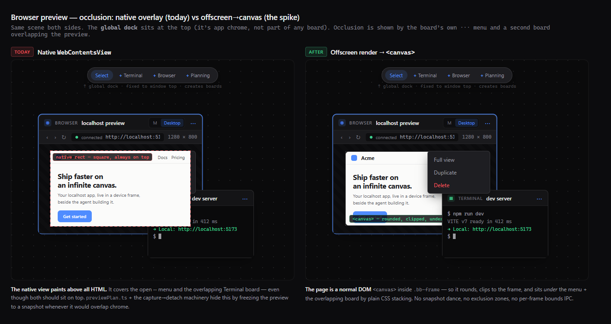

# Spike spec — Offscreen-render Browser preview into an HTML `<canvas>`

**Status:** PROPOSED (awaiting sign-off) · **Date:** 2026-06-14 · **Type:** time-boxed throwaway spike
**Owner:** TBD · **Motivated by:** [`README.md`](./README.md) §2 (Issue A) + §4 (Phase 0)
**Decides:** whether browser-preview **occlusion** can be fixed inside Electron — and therefore whether
the Electron→Flutter migration question stays closed.

> **One-sentence goal.** Render ONE Browser board offscreen, stream its frames into a DOM `<canvas>`
> inside `.bb-frame`, forward input back to it, and **measure** throughput + sharpness + input fidelity
> against the current native path — to prove (or disprove) that the preview can become an ordinary
> clippable/rounded/z-orderable element and the native overlay can be deleted.

This is a **spike**, not a feature. Success = a measured go/no-go, behind a flag, with the shipping
native path untouched. We are buying information, not shipping a preview engine.

---

## 1. Problem (grounded in the code)

Each Browser board's live page is a native `WebContentsView` added to the window's view tree:

- `src/main/preview.ts:508` — `owner.contentView.addChildView(e.view)` (inside `attach()`).

A `WebContentsView` is a **separate native OS/Chromium compositor surface**. It paints **above the
entire HTML layer** with no z-index, clip, `border-radius`, or transform relationship to the DOM
(**ADR 0002**). Consequences, all visible in the current code:

1. It can only ever be an **axis-aligned, unrounded rectangle on top**. Every rounded edge, the device
   notch, the URL bar, and the letterbox in `BrowserBoard.tsx` is HTML chrome drawn *around* an
   unrounded native rect.
2. It paints over any board or app chrome it overlaps. The codebase carries a whole apparatus to dodge
   this:
   - `previewPlan.ts` → `chromeExclusionZones()` (hand-maintained dock + camera-cluster rects),
     `shouldDemoteForOcclusion()`, `rectsOverlap()`.
   - `usePreviewManager.ts` → `beginMotion`/`endMotion`/`demoteToSnapshot` + the `demoting` race-guard
     set: **capture → snapshot → detach** every live view during pan/zoom/drag/menu so a clippable HTML
     `` carries the motion instead of a native layer trailing at the old
     position (Electron #43961).
   - The `setVisible(false)`-before-`removeChildView` "ghost" dance (`preview.ts:540`).
   - UI gymnastics: the URL error is forced *into the bar's own height* and never over the stage,
     "because a live native view paints above any HTML it overlaps" (`BrowserBoard.tsx:401-412`).

This apparatus works but is **fragile** — it is the direct source of the PR #82-class camera-sync /
digest-panel occlusion bugs. ADR 0002 records occlusion as inherent and *pre-authorizes the fix this
spike tests*: "Build as real WebContentsView so CDP attach can be added later."

**Already built (the half we reuse):** capture + clipped render. `preview:capture` →
`webContents.capturePage()` → dataURL (`preview.ts:635`), rendered as `` UNDER
the device frame (`BrowserBoard.tsx:543`). The spike upgrades that **frozen single-shot image** into a
**live frame stream into a `<canvas>`**.

---

## 2. Goal / non-goals

**Goal.** Replace `addChildView` (native overlay) with: offscreen render → IPC frame stream → paint into
a `<canvas className="bb-live">` inside `.bb-frame`. Because the canvas is a normal DOM node it inherits
`.bb-frame`'s `border-radius`, z-order, and the React Flow `scale(z)` transform — **occlusion ceases to
exist** rather than being mitigated.

**In scope (spike):**
- ONE Browser board, behind a runtime flag, leaving the native path fully intact and default.
- The offscreen render + frame transport (MAIN) and the canvas paint (renderer).
- Minimal input forwarding: one click + scroll + keypress.
- The four measurements in §6 (the go/no-go).

**Out of scope (spike) — these are the *payoff* if it graduates, NOT spike work:**
- Deleting the native path / motion apparatus / exclusion zones (the §7 delete list).
- Multi-board, full-view, screenshot, auto-connect, and responsive-preset parity hardening.
- IME, complex drag-and-drop, file inputs, accessibility of the canvas.
- An ADR amendment + rollout plan (written only if the spike says "go").

**Non-negotiable carry-overs (must remain byte-for-byte equivalent in the new path):** per-view session
`partition: preview-${id}` · deny-all permission handlers (`preview.ts:352`) · http(s) nav scheme
allowlist (`registerPreviewNavGuards`) · external-open token bucket · `isForeignSender` frame guard on
every handler · PTY channel untouched. None of these are occlusion-related, so they port verbatim.

---

## 3. Design artifact (z-order, before/after)

This spike changes *architecture*, not visible pixels — a correct implementation looks **identical** to
today at rest. The meaningful artifact is the **compositing/z-order behaviour** (the thing that's
broken-and-worked-around today).

**Rendered mock** (real `index.css` tokens; source `.claude/mocks/preview-occlusion-mock.html`). Same
scene both sides — the **global dock** is top-center app chrome (NOT part of any board), and occlusion is
shown by the Browser board's own ⋯ menu and a second (Terminal) board overlapping the preview:



- **Today (left):** the native view paints above all HTML — it **swallows the ⋯ menu** and **cuts across
  the overlapping Terminal board**, even though both should sit on top. `previewPlan.ts` + the
  capture→detach machinery hide this by freezing the preview to a snapshot whenever it would overlap chrome.
- **After (right):** the page is a normal DOM `<canvas>` inside `.bb-frame` — it rounds, clips to the
  frame, and sits *under* the menu + overlapping board by plain CSS stacking. No snapshot dance, no
  exclusion zones, no per-frame bounds IPC.

The same relationship as a schematic (a Browser board with chrome overlapping its preview area):

```
TODAY (native WebContentsView)                AFTER (offscreen → <canvas>)

  ┌─ ⋯ menu (HTML) ┐  ← must be DEMOTED         ┌─ ⋯ menu (HTML) ┐  ← paints normally
  │  Full view     │    (snapshot) or the       │  Full view     │    OVER the canvas;
  │  Duplicate     │    native rect covers it    │  Duplicate     │    no demotion needed
  └───────┬────────┘                             └───────┬────────┘
          │ overlaps preview                             │ overlaps preview
  ╔═══════▼═══════════════╗  native layer        ┌───────▼───────────────┐  <canvas> is a
  ║  P R E V I E W  (top) ║  paints ABOVE all     │  p r e v i e w        │  normal DOM node:
  ║   ▓▓▓ covers menu ▓▓▓ ║  HTML → exclusion     │   clips under menu,   │  z-order + clip +
  ║                       ║  zones + capture→     │   rounds, scales,     │  border-radius all
  ╚═══════════════════════╝  detach machinery     └───────────────────────┘  "just work"

  Z-ORDER:  native view  ▔▔▔▔▔▔▔▔▔  (always front, can't reorder)
            HTML chrome  ▁▁▁▁▁▁▁▁▁  (menu / other board / toast / modal — all below)

  AFTER Z-ORDER (normal CSS stacking):
            menu / other board / toast / modal  ▔▔▔  (front)
            <canvas class="bb-live">            ▒▒▒  (in .bb-frame, clipped + rounded)
            bb-snapshot / state fallback        ▁▁▁  (under, unchanged)
```

**Acceptance for the artifact:** at rest the spike board is pixel-indistinguishable from a native board;
the *difference* is only observable by overlapping it with chrome — where today's board must demote and
the spike board simply renders underneath. The device frame, notch, URL bar, and letterbox are unchanged
(the `<canvas>` occupies exactly the `.bb-frame` inner rect the native view occupies today).

---

## 4. Architecture — the swap

```
                MAIN (preview.ts)                         RENDERER (BrowserBoard + hook)
   ┌───────────────────────────────────────┐      ┌────────────────────────────────────────┐
   │ ensureOffscreen(id):                   │      │ <div class="bb-frame">                 │
   │   new WebContentsView({                │      │   <canvas class="bb-live"/>  ◄── frames │
   │     webPreferences:{ offscreen:true,   │      │    (fallback) │
   │       partition, sandbox, ... }})      │      │ </div>                                  │
   │   — NEVER addChildView (off the tree)  │      │                                        │
   │   wc.setFrameRate(N)                   │      │ onPreviewFrame((id,bitmap,dirty)=>     │
   │   wc.on('paint', (e,dirty,image) ──────┼─ preview:frame ─► ctx.putImageData / drawImage │
   │   wc.loadURL(url)  (same guards)       │      │                                        │
   │   sendInputEvent(evt) ◄────────────────┼─ preview:input ◄─ pointer/wheel/key (mapped)  │
   └───────────────────────────────────────┘      └────────────────────────────────────────┘
```

**Transport — two options, spike tries A, falls back to B:**

| | A — Offscreen `'paint'` | B — CDP `Page.startScreencast` |
|---|---|---|
| Setup | `webPreferences.offscreen: true` at creation | `wc.debugger.attach('1.3')` + `Page.startScreencast` |
| Frame | `'paint'` → `NativeImage` + dirty rect (efficient partial repaints) | `screencastFrame` → base64 JPEG/PNG, must `ack` each |
| Renders headless? | **Yes** — designed to composite without a window | Uncertain on a view that's off the tree (open Q §5) |
| ADR status | allowed | **explicitly pre-authorized** (ADR 0002) |
| Lean | **Spike default** — surest renderer, dirty-rect efficient | Fallback if `'paint'` throughput/colour is poor |

Both share the hard parts: **input no longer arrives for free** (must hit-test + forward) and **GPU
readback** per frame. That's exactly what the spike measures.

**Frame → canvas mapping (the sharpness trap).** The frame must be requested/painted at **device pixels
× camera zoom**, and the `<canvas>` backing store sized to match, or the compositor bilinear-resamples a
fixed-dpr bitmap — i.e. you reintroduce the *exact* terminal-blur class just fixed in #122
(`README.md` §2 Issue B). Prove DPR-under-camera-zoom sharpness FIRST; it's the subtlest correctness
risk, cheaper to kill the approach on than throughput.

---

## 5. Build plan (additive, flag-gated, one board)

A throwaway branch; nothing here is meant to be the final shape. **Flag:** `VITE_PREVIEW_OSR=1` (env) or
a hidden board-data bit, read once at board creation to route `ensure` → `ensureOffscreen`.

**MAIN — `src/main/preview.ts`**
1. `ensureOffscreen(id, win)`: clone `ensure()` but (a) `webPreferences.offscreen: true`, (b) **omit**
   `addChildView`, (c) keep session/partition, permission handlers, nav guards, load latch, crash/ready
   gate verbatim. `wc.setFrameRate(30)` to start.
2. `wc.on('paint', (_e, dirty, image) => emitFrame(id, image, dirty))` → new push channel
   `preview:frame` (mirror the `preview:event` emit pattern, `:316`). Send `image.getBitmap()` +
   `image.getSize()` + dirty rect; transfer the buffer (avoid a copy).
3. New handler `preview:openOffscreen` (frame-guarded by `isForeignSender` like all others) that calls
   `ensureOffscreen` + `loadURL` through the SAME `isAllowedPreviewUrl` gate.
4. New handler `preview:input` (frame-guarded) → `wc.sendInputEvent(evt)`. The primitive is proven:
   `debugSendInputToView` (`:900`) already drives `sendInputEvent` against a preview view in e2e.

**PRELOAD — `src/preload/index.ts`**
5. Add `openOffscreenPreview`, `sendPreviewInput`, and `onPreviewFrame(listener)` mirroring the existing
   `openPreview` / `onPreviewEvent` shapes (`:157`, `:198`).

**RENDERER — `src/renderer/src/canvas/boards/BrowserBoard.tsx` + new `useOffscreenPreview.ts`**
6. When the flag is on, render `<canvas className="bb-live">` as the first child of `.bb-frame` (sibling
   above `bb-snapshot`, `:543`); size its backing store to `frame.width*dpr*camZoom × frame.height*…`.
7. `useOffscreenPreview(id, canvasRef)`: subscribe `onPreviewFrame`, `putImageData`/`drawImage` each
   frame; on the SAME board, **bypass `usePreviewManager`** entirely (no `setBoundsBatch`, no
   capture/detach — the canvas moves with the DOM).
8. Input: on the canvas, translate pointer/wheel/key events from canvas-local → page px (undo camZoom ×
   device-preset scale from `browserLayout`) and call `sendPreviewInput`.

**No deletions in the spike.** The native path, `usePreviewManager`, and `previewPlan` stay exactly as
they are; the flag routes one board around them.

---

## 6. Acceptance — the measurements (this IS the deliverable)

The spike passes only if **all four** hold for one offscreen board; record numbers in a results note.

| # | Measure | Method | Pass threshold |
|---|---|---|---|
| M1 | **Sharpness at settled zoom** | Screenshot the canvas at z = 0.5/1/2; compare text crispness to a native board side-by-side | No worse than native at rest (no resample blur) |
| M2 | **Throughput** | Frame rate + MAIN CPU% with the board scrolling/animating, vs the native ~165fps/6.1ms baseline; watch for PTY starvation (type in a Terminal board concurrently) | ≥30fps steady; no perceptible PTY input lag |
| M3 | **Input fidelity** | One link click navigates; wheel scrolls the page; a keypress reaches an input on the page | All three work; coords correct under camera zoom |
| M4 | **Responsive reflow** | Switch Mobile/Tablet/Desktop (390/834/1280); the page reflows at the true breakpoint | Reflow correct, matching `setZoomFactor` behaviour today |

**Kill order (cheapest-first):** M1 → M2 → M3 → M4. If M1 fails (blur unfixable) or M2 fails
(readback starves MAIN/PTY), stop — those are the structural showstoppers. M3/M4 failures are likely
solvable with more input/zoom plumbing and wouldn't by themselves sink the approach.

---

## 7. Payoff if it graduates (OUT OF SPIKE SCOPE — for context only)

What a follow-on feature would delete once the native path is retired:

| Layer | Removed | Why dead |
|---|---|---|
| `preview.ts` | `attach`/`detach`, the #43961 `setVisible`-ghost dance (`:540`), `preview:capture`/`detach`/`attach`/`detachAll`, the `ready` snapshot-until-ready gate | no native layer to attach/hide/ghost |
| `usePreviewManager.ts` | `beginMotion`, `demoteToSnapshot`, `endMotion`, the `demoting` race-guard set, **the per-frame `setBoundsBatch` rAF pump**, the full-view pump | a `<canvas>` moves with the DOM → zero per-frame IPC to MAIN (today shared with node-pty) |
| `previewPlan.ts` | `chromeExclusionZones`, `shouldDemoteForOcclusion`, `rectsOverlap`, the focus-isolation branch in `isLiveEligible` | occlusion no longer exists |
| `BrowserBoard.tsx` | "never render over the stage" gymnastics (inline URL error, snapshot-under-native) | the canvas is clippable; overlays just work |

`MAX_LIVE = 4` likely **stays** (offscreen renderers still cost RAM/CPU) but becomes a pure perf cap,
not a "cap-or-it-covers-things" constraint.

---

## 8. Risks & open questions (the spike resolves these)

1. **Does an off-tree, non-offscreen view composite at all?** (Drives the A-vs-B choice.) Offscreen
   `:true` is designed to render headless — A is the safer default.
2. **Readback cost in a shared MAIN.** MAIN already runs node-pty; per-frame GPU readback could starve
   PTY I/O (M2 explicitly co-tests this).
3. **DPR/sharpness** under camera zoom (M1) — the terminal-blur class returning.
4. **Input coordinate transform** correctness under camZoom × device-preset scale (M3); IME/drag
   deferred.
5. **Colour/alpha fidelity** of `'paint'` `NativeImage` vs screencast JPEG (visual diff in M1).
6. **`setFrameRate` floor** — how low can we cap idle boards before interaction feels laggy.

---

## 8b. Spike findings (running log)

**2026-06-14 — §5 Q1 RESOLVED: offscreen rendering works, but the host must be a hidden
`BrowserWindow`, not a bare `WebContentsView`.** A headless paint-probe in the self-test
(`previewOsr.ts` › `probeOsrPaint` / `probeOsrPaintWindow`, surfaced via `runSelfTest` →
`SELFTEST_DONE`) measured both hosts against the bundled local server:

| Host | Result |
|---|---|
| Bare off-tree `WebContentsView` (`offscreen:true`, never `addChildView`) | **No frames.** Page loads (`finishLoad=true`) and `isPainting=true`, but `paint` never fires (`paints=0`). With a forced `invalidate()` it emits a single **0×0** frame — i.e. no render surface size without a window host. |
| Hidden offscreen `BrowserWindow` (`show:false`, `offscreen:true`, sized 1280×800) | **Works.** `painted 1280x800 (after 1 paints)` — a real, correctly-sized frame on the first paint. |

**Consequence for the build plan (§5):** the producer's host changes from `WebContentsView`
→ a **hidden offscreen `BrowserWindow` per Browser board** (the window size drives the render
surface). Everything downstream is unchanged — same `paint` → BGRA → `preview:osrFrame` →
`<canvas>` pipeline, same security carry-overs. Open sub-questions this introduces: hidden-window
lifecycle/cleanup (`destroy()` per board), `skipTaskbar`/focus hygiene, and whether one shared
hidden window can host multiple boards' content vs one window each. Transport option A (offscreen
`'paint'`) stays the default; CDP option B is not needed yet. M1 (DPR sharpness) and M2 (throughput)
remain the next measurements, now against the BrowserWindow host.

---

## 8c. Interaction-fidelity findings + gap register (2026-06-15)

Once frames flowed, the spike hit a recurring **class** of bug: native/browser behaviours
that silently break when a page is rendered offscreen to a bitmap and driven by synthetic
`sendInputEvent`. We fixed them reactively (cursor → caret → focus ring), then ran two
research workflows — one to fix the feedback, one to **proactively enumerate the rest** —
so the gaps are known, not discovered live.

### Shipped this pass (commit `feat(spike): browser-like feedback + P0 hardening`)

**Feedback (feel like a real browser):**
- **Cursor** — forward `webContents 'cursor-changed'` → `preview:osrCursor` → `canvas.style.cursor`
  via an Electron-type→CSS map (I-beam over inputs, pointer over links; custom = data-URL `url()`).
- **Caret + animations** — `backgroundThrottling:false` so the hidden window's rAF/timers don't pause.
- **Caret + `:focus` ring** on a never-OS-focused window — CDP `Emulation.setFocusEmulationEnabled`
  over `wc.debugger`, driven **per-interaction** (`preview:osrFocus` on canvas focus/blur) so
  `blur`/`focusout`/`visibilitychange` still fire.
- **Hover-clear** on `pointerleave` + flush the coalesced move before `mouseUp` (exact endpoints).
- **Full view** — keep the OSR window alive across the portal relocation (it was being destroyed on enter).
- **Un-clickable preview fix** — the input hook bailed when the canvas was absent on the first tick
  (deferred content host); rAF-wait for it.

**P0 hardening (from the sweep — two were self-inflicted by the feedback fixes):**
- 🔒 **Popup security** — `setWindowOpenHandler` (deny + token-bucket open-external) on the OSR window.
  A previewed page's `window.open`/`target=_blank` no longer mints a real desktop window outside the
  deny-all/nav-guard/partition posture (a scripted page could tab-bomb the desktop).
- **Load/crash lifecycle** — wired the native path's load-latch + crash-ready gate + `did-navigate`
  onto the OSR `wc`, emitting the shared `preview:event` channel (consumed slimly in
  `useOffscreenPreview`) so a dead/404/crashed server shows Connecting → Couldn't-load / Preview-crashed
  + a working Reload (`preview:osrReload`) instead of a frozen bitmap.
- **Focus regression** — the always-on focus emulation (caret fix) permanently killed
  `blur`/`focusout`; the per-interaction toggle above restores them.

### Review follow-ups (2026-06-15 — deep review, 41 findings, 0 crit/high)

A 6-dimension adversarial review (`docs/reviews/2026-06-15-osr-preview-review/`) found the spike clean —
the flag-off path is byte-for-byte the shipping native path and every §2 security carry-over is present —
with **no critical/high** issues. It also confirmed this register is **accurate on what it lists** (every
"Shipped this pass" claim and every P1/P2 row verifies against code) but **incomplete**: four user-visible
gaps shipped *without a row*. Three are fixed in this pass; the fourth is added to the P1 table below.

**Fixed this pass (`fix/osr-review-followups`):**
- **URL-bar Back / Forward / Reload wired for OSR** — they routed to the native `preview:goBack/
  goForward/reload` handlers (which `views.get(id)` returns undefined for in OSR mode), so the buttons
  were live-but-dead (Back/Forward even *enabled* off OSR `did-navigate` state, then no-op'd). Added
  `preview:osrGoBack`/`preview:osrGoForward` (frame-guarded, mirroring the native handlers) +
  `goBack/goForwardOsrPreview` preload methods; the four URL-bar buttons now branch on `OSR_PREVIEW`.
  Screenshot is explicitly disabled in OSR mode (the native `capturePage` path has no view).
- **Auto-connect restored in OSR** — `useBrowserAutoConnect` lived inside `NativePreviewLayer`, which
  never mounts when the flag is on, so reconnect-on-refused + auto-push-detected-port silently vanished
  in OSR mode. Hoisted into `BrowserPreviewLayer` above the OSR early-return (it only steers `board.url`,
  never a native view, so it is engine-agnostic).
- **Stale-frame trap closed** — `useOffscreenPreview` cleared the canvas only on crash, so a URL change
  or a failed reload left the previous page's last frame painted *over* the Connecting/Couldn't-load
  fallback. Now also clears on `did-fail-load` and on effect-cleanup (URL change / unmount). (Distinct
  from the still-open M2 "stale frame on resume/zoom-settle" row, which needs `wc.invalidate()`.)

### Open gap register (P1 — important, not yet built)

| Gap | Status | Sev × Likely | Fix lever |
|---|---|---|---|
| IME / composition (CJK, emoji, dead keys) typing | broken | high × med | CDP `Input.imeSetComposition`/`insertText` over the attached `wc.debugger` |
| Native `<select>`/date/color picker list never renders | broken | high × high | OSR can't composite popup widgets (electron #34095) → MAIN-side CDP-driven React overlay |
| **M1** fixed-1280×800 bitmap blurs at every zoom | broken | high × high | `setContentSize(W*S)+setZoomFactor(S)` supersample (no `setDeviceScaleFactor`) |
| **M2** every board paints forever (CPU/battery) | broken | high × high | per-board `setFrameRate`/`stopPainting` visibility-gating + `MAX_LIVE`; honor `dirtyRect`; `createImageBitmap` |
| **MAX_LIVE** uncapped — N OSR boards = N full hidden renderer processes (added 2026-06-15; broader than M2 frame-gating) | broken | high × med | `MAX_LIVE` cap that `destroy()`s far/over-cap offscreen windows + recreates on demand (the native path's cap, ported) |
| **M4** responsive presets don't reflow | broken | high × high | `setContentSize(presetW)` per preset + update the input transform off the live width |
| Clipboard Ctrl+C/X/V flaky | partial | high × high | route to `wc.copy()/cut()/paste()/selectAll()` (not synthetic chords) |
| AltGr (€) chars dropped + corrupted into Ctrl+Alt | broken | med × med | detect AltGr, still emit `char`, strip control/alt mods (or route all text via `Input.insertText`) |
| `<input type=file>` + `alert/confirm/prompt` un-parented; confirm/prompt FREEZE the preview | partial | med × low | CDP `Page.javascriptDialogOpening`/`handleJavaScriptDialog` + `Page.setInterceptFileChooserDialog` |
| `<video>/<audio>` audio from invisible window, no mute | partial | med × med | `setAudioMuted` off-screen/over-cap + per-board mute toggle |
| Downloads unhandled (silent/stray saves) | broken | med × med | `session.on('will-download', …)` policy (toast + `setSavePath` or prevent) |
| Forwarded wheel jumpy (no precise deltas/ticks) | partial | med × med | `hasPreciseScrollingDeltas`/`wheelTicks`; sane line/page mapping |
| Stale frame on resume/zoom-settle (once M2 gating lands) | partial | med × med | `wc.invalidate()` on every resume/visibility-active |

### P2 (nice-to-have)
60fps animation cap (`setFrameRate(60)` focused board) · custom-cursor `toDataURL()` DoS rate-limit ·
`document.title`/favicon → board chrome (`page-title-updated`/`page-favicon-updated`) · `requestFullscreen`
→ board full view · native right-click menu (`wc.on('context-menu')`) · debugger re-attach on
DevTools-open/crash · teardown symmetry (`debugger.detach()` + `removeAllListeners` + `stopPainting()`
before `destroy()`) · paint-watchdog · ctrl+wheel page-zoom guard (`setVisualZoomLevelLimits(1,1)`) ·
page `navigator.clipboard` (intentionally denied) · unmapped-key leakage · `osrInput` event-type allowlist.

### Quick probes (confirm a suspected gap in dev)
- `window.open`/`target=_blank` → stray desktop window? (security) — **now fixed**
- Dead URL `localhost:9999` / crash → Couldn't-load / Preview-crashed + Reload? — **now fixed**
- Open a menu, click outside → does it close? (blur) — **now fixed by the per-interaction toggle**
- Switch OS to a CJK IME / press a dead key → does non-ASCII type? — **broken (P1)**
- Click a native `<select>` / `<input type=date>` → does the list/calendar appear? — **broken (P1)**
- Zoom the canvas and read preview text → soft at every zoom? — **M1**
- 4 boards panned off-screen, walk away → CPU stays pegged? — **M2**
- Mobile preset on a responsive site → does it actually reflow (hamburger)? — **M4**
- `Ctrl+C` selected text → does paste land elsewhere? — **partial (P1)**
- Play a `<video>` → audio with no visible source / no mute? — **partial (P1)**

**Provenance:** two dynamic research workflows (2026-06-15) — `osr-feedback-research` (5 agents) and
`osr-fidelity-gap-sweep` (6 agents) — grounded in `previewOsr.ts`/`useOffscreenInput.ts`/
`useOffscreenPreview.ts`/`BrowserBoard.tsx` + Electron 42 docs (context7) + Electron/Chromium prior-art
(electron #34095/#34047/#44186 select popups, #4912 hover, #10510 OSR dialogs, #7830 paint-stops,
#39859 WebGL OSR, #6338 macOS copy). The cursor/caret/focus class and the security/lifecycle gaps all
trace to the same root: a flat bitmap + a hidden, never-OS-focused window + synthetic input.

---

## 9. Effort & decision gate

**Effort:** ~1–2 weeks, one engineer, one board, behind a flag. Reuses the already-built capture/clipped-
render half and ADR 0002's CDP pre-authorization.

**Outcomes:**
- ✅ **All four pass** → occlusion is fixable in Electron. The Flutter-migration motivation collapses
  (`README.md` §3). Write the follow-on feature spec + ADR 0002 amendment; reinvest the ~18–24 saved
  engineer-months into **Phase 5 (packaging/signing)**, the real release blocker.
- ❌ **M1 or M2 fails structurally** → document the wall. *Only then* does a Flutter rewrite (with its own
  `webview_cef` texture spike, `README.md` §5) earn serious consideration.

**Process:** per CLAUDE.md this spike's branch + docs live on a `feat/preview-offscreen-spike` worktree,
not `main`; this spec moves there on sign-off. The results note lands next to it; if the verdict is "go,"
the ADR amendment is the only thing that promotes to `main`.
